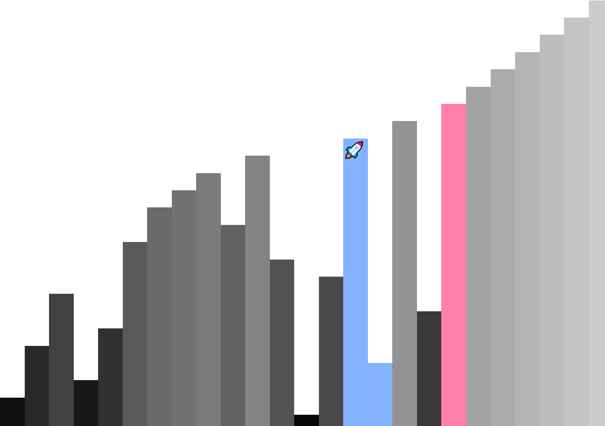

# sorting-algorithm-visualizer

## Motivation

This little project is heavily inspired by a video called "15 Sorting Algorithms in 6 Minutes" by Timo Bingmann.

Having seen the video multiple times, I want to implement a sorting algorithm visualizer of my own, but for some reason I never had the chance to complete it until now, that is.

## Description

In my version of sorting algorithm visualizer, you can investigate exactly what the algorithm is doing to the input.
The visualizer will describe that two elements are being compared, or being swapped, or has been swapped.

So far, common sorting algorithms are included:

- [x] Bubble sort
- [x] Insertion sort
- [x] Selection sort
- [x] Merge sort
- [x] Heapsort
- [x] Quicksort
- [x] Counting sort

Also, the visualizer looks better on tall screens on wide screens for some reason.

## Screenshots



## Useful CLs

Pushing `dist/` directory to `branch_name` branch.

```bash
npx gh-pages -d path/to/dist/ -b branch_name
```

## References

- "15 Sorting Algorithms in 6 Minutes" by Timo Bingmann (YouTube): https://www.youtube.com/watch?v=kPRA0W1kECg

## Sources

Comparison-based sorting algorithms:

- Bubble sort (Wikipedia): https://en.wikipedia.org/wiki/Bubble_sort
- Insertion sort (Wikipedia): https://en.wikipedia.org/wiki/Insertion_sort
- Selection sort (Wikipedia): https://en.wikipedia.org/wiki/Selection_sort
- Merge sort (Wikipedia): https://en.wikipedia.org/wiki/Merge_sort
- Heapsort (Wikipedia): https://en.wikipedia.org/wiki/Heapsort

Non-comparison sorting algorithms:

- Counting sort (Wikipedia): https://en.wikipedia.org/wiki/Counting_sort
